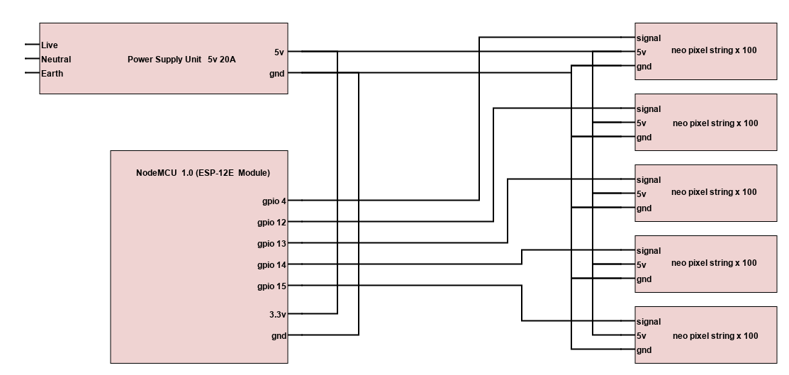

##Physical Device

### Circuit Diagram

### Neo pixel strings

These units [WS2811 neo-pixels](https://www.aliexpress.com/item/32977166287.html?spm=a2g0o.productlist.0.0.1f3a3601r3WccF&algo_pvid=bacec563-528e-4609-8767-c2927b73f3e1&algo_exp_id=bacec563-528e-4609-8767-c2927b73f3e1-42&pdp_ext_f=%7B%22sku_id%22%3A%2267177812220%22%7D)
work well for Christmas lights, especially
for putting on a tree etc.

These strings of 50 lights can be connected in multiples of 50.
 
A single string of 500 is easy to address. If you only power at a 
single point the voltage drop will be a problem from somewhere near 
and beyond the 100th light. The alternate is to provide 
power at a few points along the string. That's a messy solution.

Having individually powered strings is attractive and straight 
forward to power. The issue here is addressing them.
There are 2 options:
 - one address line per string, therefore a controller with a gpio for each string.
 - one address line for all lights. Then the end of each string must pass the address line to the next string. This is another nessy solution.
 
I've chosen to use 5 strings of 100, each individually addressed.

### Powersuply

We need a 5v PSU. As for current and power: 
a neo-pixel full on runs at 0.06W. 
 
total power = 500*0.06 = 30W

total current = 30/5 = 6A

I had a 5V/20A PSU handy so am using an over specified unit.
 
example: 
 [PSU 5V 7A](https://ie.farnell.com/xp-power/lcw35us05/power-supply-ac-dc-5v-7a/dp/3790299?st=lcw)

### Microcontroller

I chose a NodeMCU 1.0 [NodeMCU 1.0 (ESP-12E Module)](https://protosupplies.com/product/esp8266-nodemcu-v1-0-esp-12e-wifi-module/).
This is an arduino compatible, wifi enabled microcontroller.